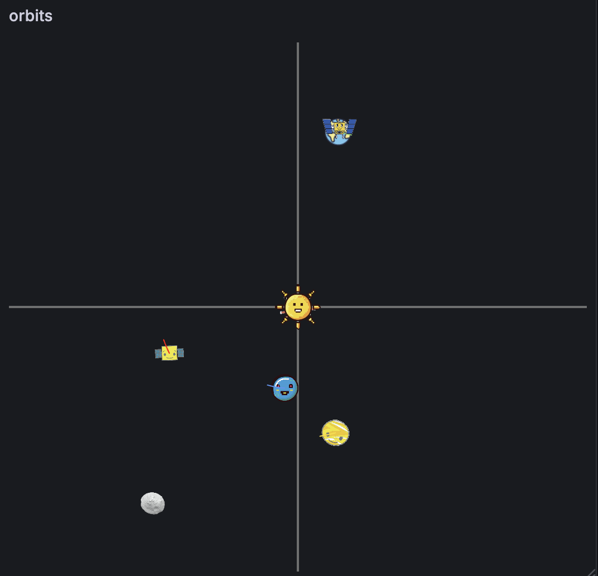

# Shaperenderer パネルプラグイン

Shaperenderer は、ダッシュボード上でインタラクティブな 2D グラフィックを直接構成できる Grafana パネルプラグインです。描画には p5.js を用い、形状のあらゆる幾何学プロパティを定数またはリアルタイムのメトリックデータで制御できます。

## 特長
- 1 つのキャンバス上で、ポイント、ライン、矩形、楕円、円、三角形、四角形、ポリライン、画像、テキストを組み合わせられます。
- 個々のフィールドセレクタを通じて、任意の座標・サイズ・色設定を Grafana のクエリ結果にバインドできます。
- ストローク、塗り、透明度、レイヤリング、表示・非表示を形状ごとに独立して制御できます。
- 軸・グリッド・表示範囲を調整して描画領域を整えたり、受信データに合わせてパネルに自動スケールさせたりできます。
- データフレームが空でも描画されるため、実データを接続する前にレイアウトを試作できます。

## 開発セットアップ
- `npm install` で依存関係をインストールします（`package.json` に記載のとおり Node 22 以上が必要です）。
- `npm run dev` で開発中の監視付き webpack ビルドを起動します。
- `npm run build` で `dist/` フォルダーに本番用ビルドを生成します。
- `npm run lint`、`npm run typecheck`、`npm run test` でコードベースを健全に保ちます。
- `npm run sign` で配布前にプラグインパッケージへ署名します。

## Grafana での使用方法
1. ビルド済みプラグインを Grafana のプラグインディレクトリにコピーするか、開発モード（`npm run dev`）を利用します。
2. ダッシュボードに新しい **Shaperenderer Panel** を追加します。
3. パネルオプションを開き、形状を追加してデータとの紐付けを開始します。

### 表示例

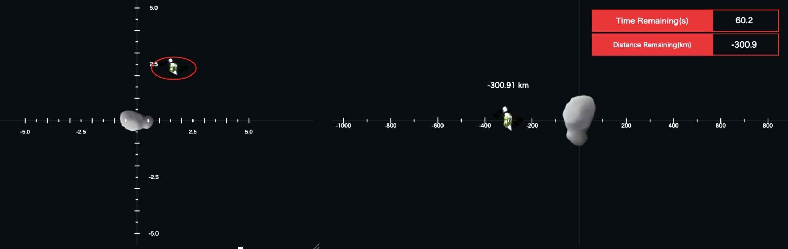

## シェイプエディタのガイド

カスタムエディタは、シェイプセレクタ、シェイプリスト、各ジオメトリタイプ専用のエディタ、そして一般的な軸／ビュー設定で構成されています。以下のスクリーンショットは各セクションを順番に示しています。

### 1. シェイプタイプの選択

**Add shape…** ドロップダウンを使って新しいプリミティブを追加します。選択すると妥当な初期値を持つ形状が生成され、すぐに調整できます。

### 2. シェイプの一覧
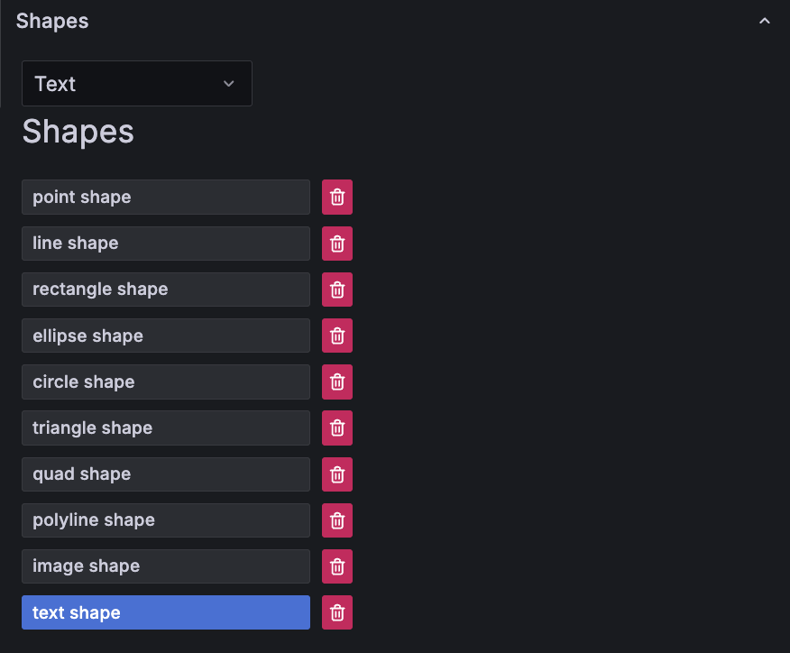
**Shapes** フィールドセットで形状のスタックを管理します。ボタンをクリックすると形状を選択でき、ダブルクリックで名前を変更し、ゴミ箱アイコンで削除できます。描画順は一覧の順序に従います。

### 3. ポイントのプロパティ
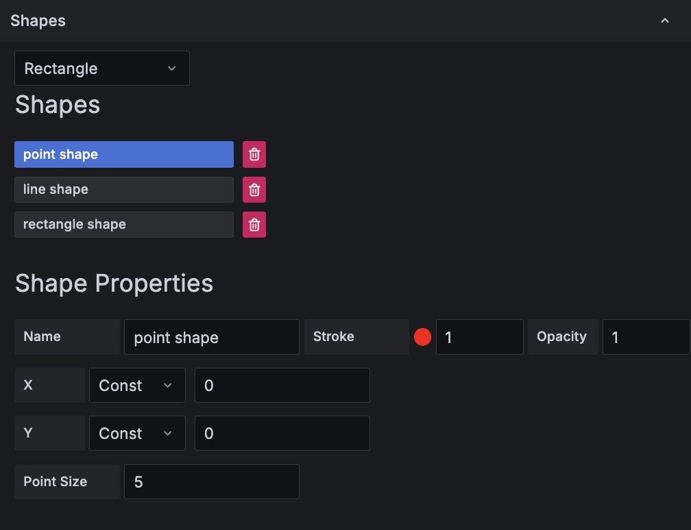
ポイントの `X`、`Y`、`Point Size` を設定します。各座標は定数にすることも、クエリフィールドから取得することもできるため、動的な配置が可能です。

### 4. ラインのプロパティ

ラインセグメントの始点 (`X1`, `Y1`) と終点 (`X2`, `Y2`) を定義します。ストローク色、線幅、透明度は全エディタ共通の項目で設定します。

### 5. 矩形のプロパティ
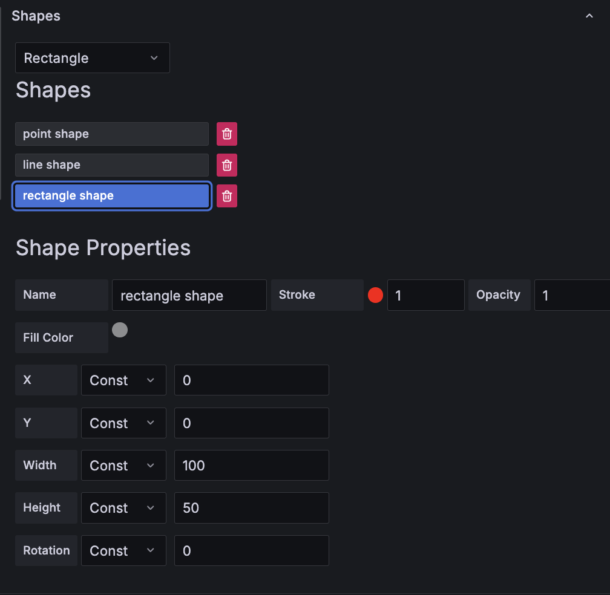
矩形の中心 (`X`, `Y`)、`Width`、`Height`、`Rotation`、`Fill Color` を指定します。時系列データに紐付けることでレスポンシブなダッシュボードを作成できます。

### 6. 楕円のプロパティ
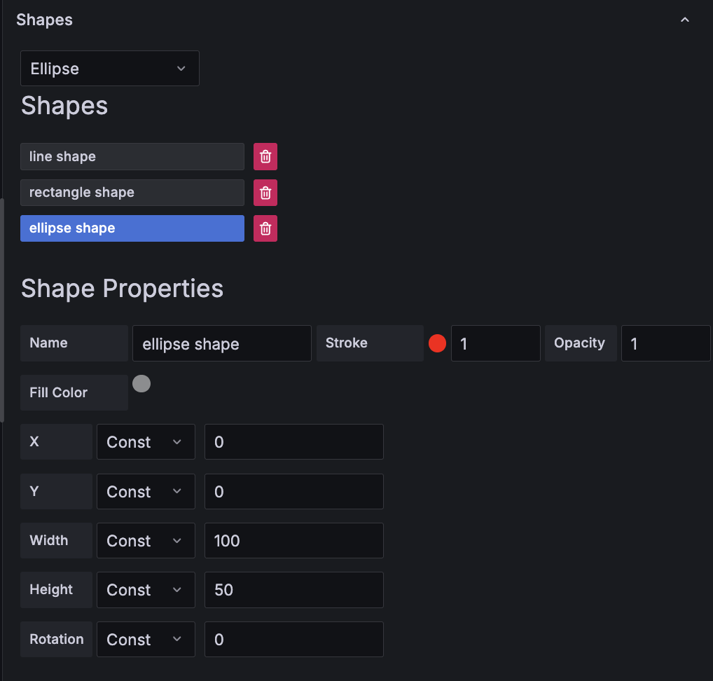
矩形と同様に、楕円も `X`、`Y`、`Width`、`Height`、`Rotation`、`Fill Color` を公開しており、数値の変化をアニメーション化できます。

### 7. 円のプロパティ
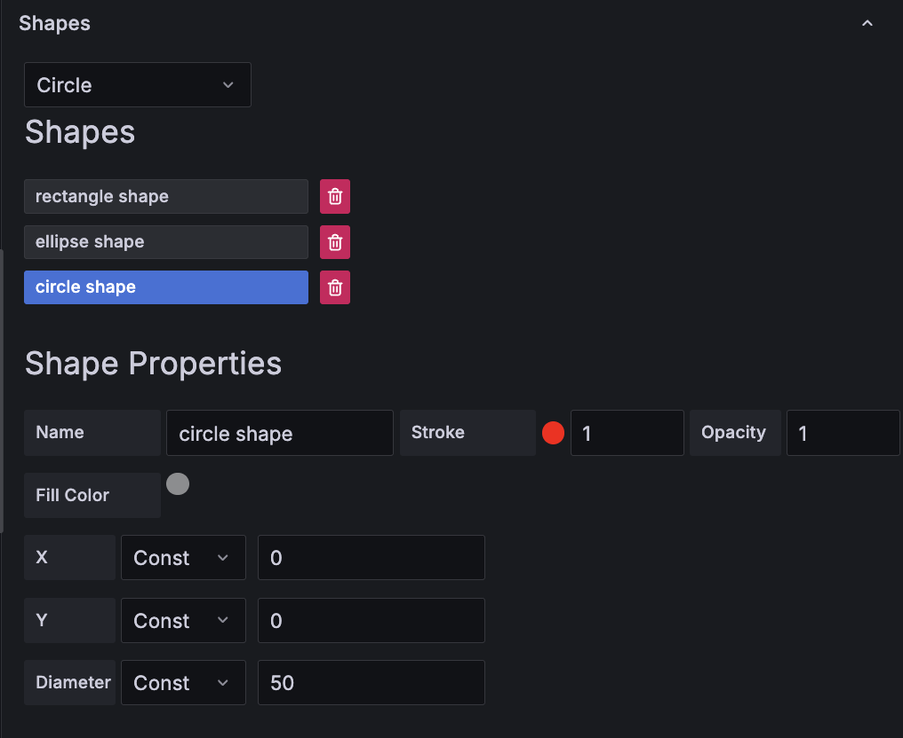
円の設定は最小限で、中心 (`X`, `Y`) と `Diameter` を指定します。必要に応じて値をデータにバインドしてください。

### 8. 三角形のプロパティ
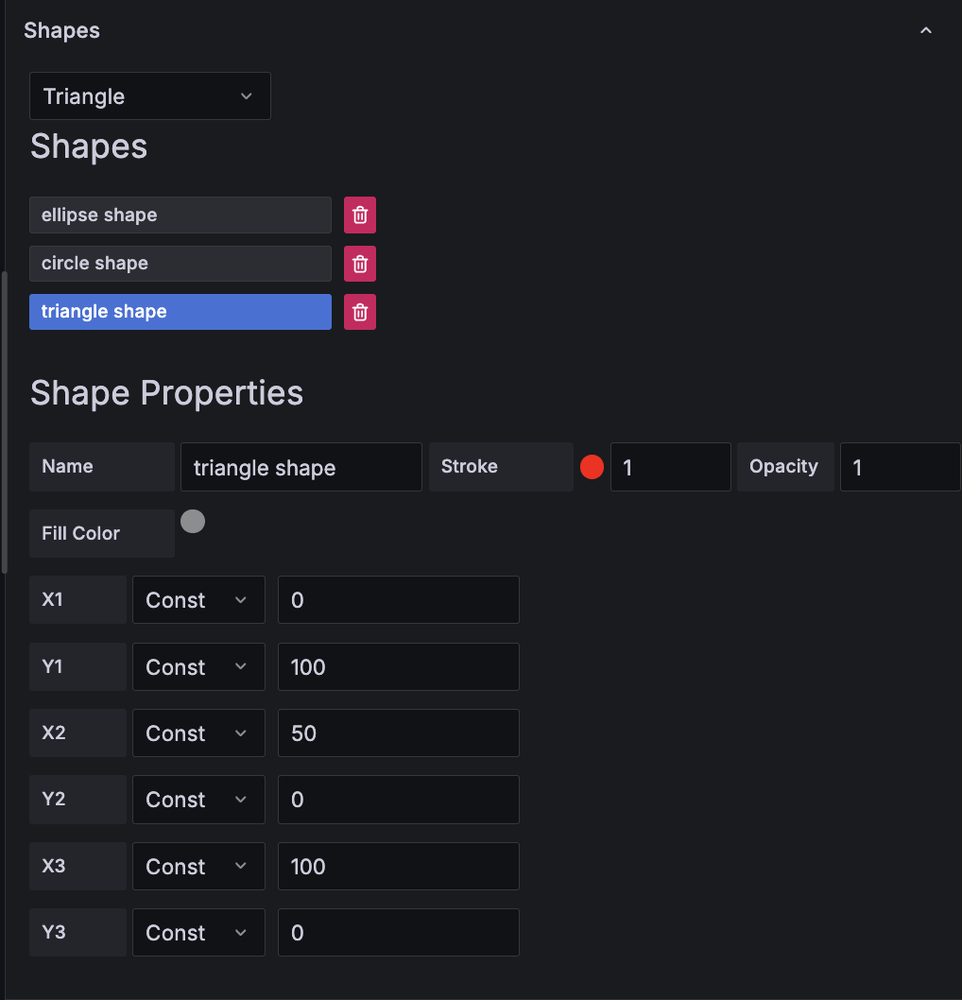
三角形は 3 つの頂点 (`X1`/`Y1`, `X2`/`Y2`, `X3`/`Y3`) を指定します。塗りと組み合わせれば、注目領域を動的にハイライトできます。

### 9. 四角形のプロパティ

四角形は三角形エディタを拡張し、4 つの頂点 (`X1`〜`Y4`) を持ちます。バウンディングボックスやヒートマップセルなどのポリゴン描画に利用できます。

### 10. ポリラインのプロパティ
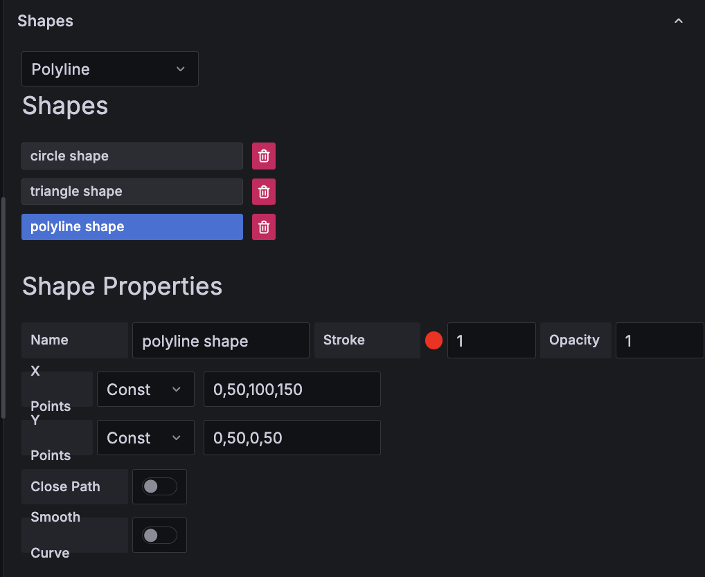
`X Points` と `Y Points` にカンマ区切りのリスト（またはフィールド由来の配列）を指定します。**Close Path** を有効にすると最初と最後の点が接続され、**Smooth Curve** でベジエ風の補間が可能です。パスを閉じると塗りつぶしも使用できます。

### 11. 画像のプロパティ
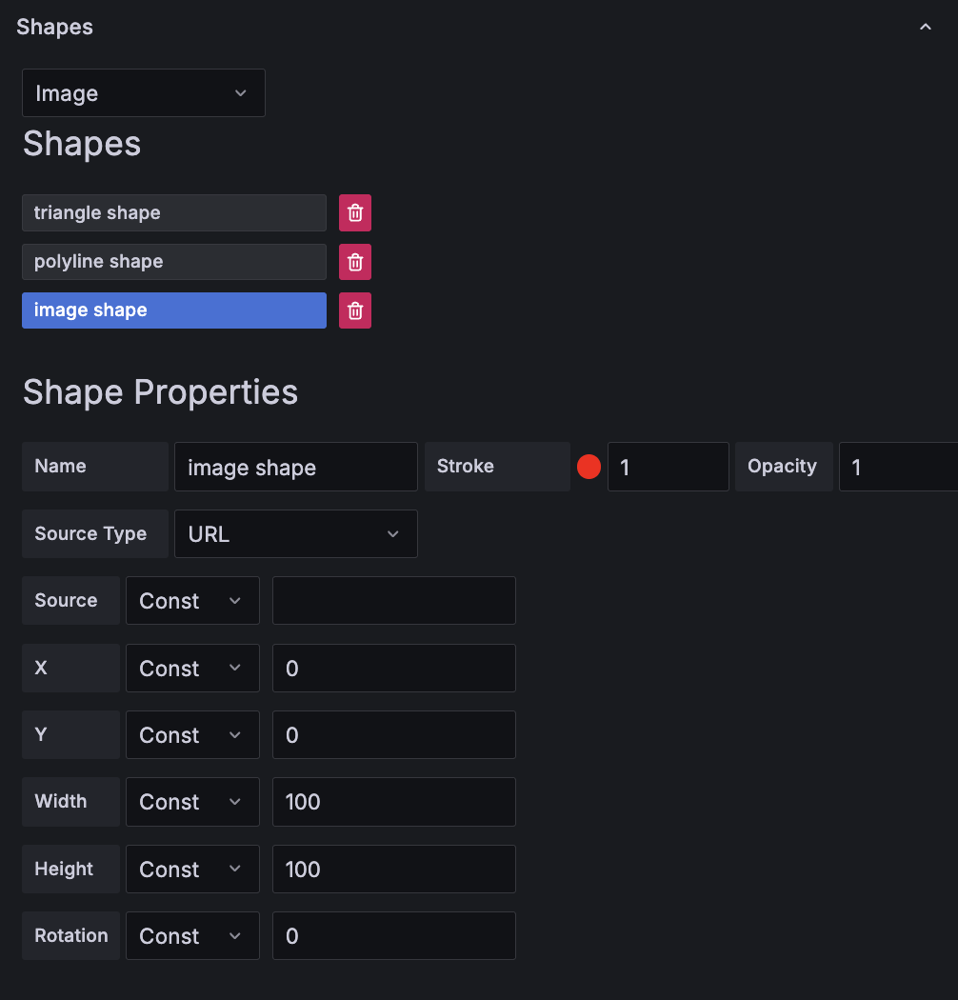
`Source Type`（`url` または `base64`）を選択し、位置、`Width`、`Height`、`Rotation` をバインドして外部画像を描画します。データ駆動のオーバーレイの背後にアイコンや図版を配置する際に便利です。

### 12. テキストのプロパティ
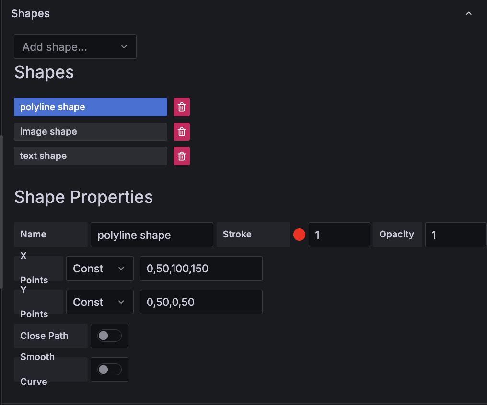
テキスト形状は位置制御とデータバインドされたコンテンツを組み合わせます。`Text Size`、`Text Color`、`X/Y Offset`、任意のフォーマット（`Format`、`Unit`）を調整し、キャンバスにリアルタイムのメトリクスを注釈として表示します。

### 13. 軸と表示設定
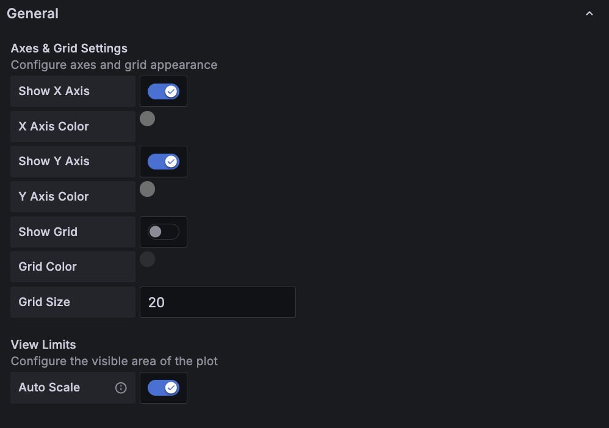
**General** カテゴリには `Axes & Grid Settings` と `View Limits` エディタが含まれます。軸の表示切り替え、色の選択、グリッドの有効化、キャンバス境界の微調整が行えます。固定座標系を使いたい場合は自動スケールを無効にしてください。

## データバインディングのヒント
- すべての数値入力は `Const` と `Field` を切り替えられます。フィールドを使う場合、パネルは元のフレームインデックスを保持するため、複数データソースがあっても正しいクエリを参照します。
- 形状と Grafana のしきい値やアラートデータを組み合わせることで、インタラクティブなオーバーレイを作成できます。
- パネルはデータがなくても描画を続けるため、まず定数でレイアウトを設計し、その後プロパティを実メトリクスに切り替えることができます。

## ライセンス
GNU Lesser General Public License v3.0 の下で提供されています。

著作者: ISAS/JAXA and [NAKAHIRA, Satoshi](https://orcid.org/0000-0001-9307-046X) (© 2025)。
